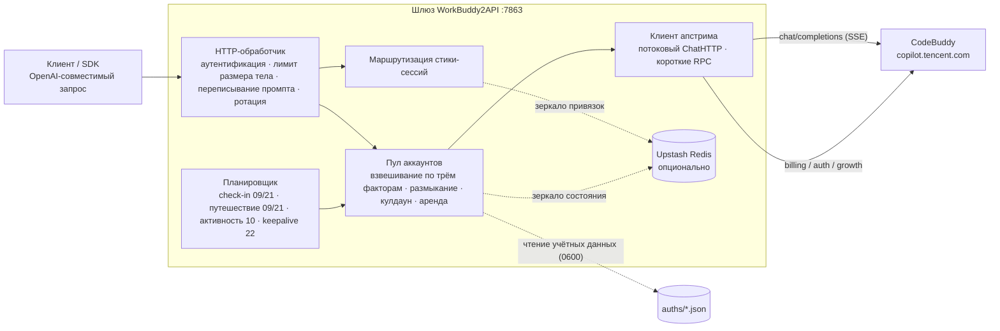

<p align="center">
  
</p>

<h1 align="center">WorkBuddy2API</h1>

<p align="center">
  <b>Превращает аккаунты Tencent CodeBuddy в OpenAI-совместимый API-шлюз с пулом аккаунтов</b><br>
  OAuth-вход · ротация пула аккаунтов · размыкание/блок и кулдаун · стики-сессии · плановые ежедневный check-in / отчёт об активности / путешествие кота / keepalive токенов · потоковый / непоточный режимы
</p>

<p align="center">
  
  
  
  
  <a href="https://t.me/sliverkiss_blog"></a>
</p>

---

## Описание проекта

WorkBuddy2API — это self-hosted **OpenAI-совместимый обратный прокси-шлюз**, который упаковывает аккаунты Tencent CodeBuddy (`copilot.tencent.com`) в единый сервис `/v1/chat/completions`.

- Официального открытого API в форме OpenAI нет, поэтому проект получает учётные данные аккаунтов через **авторизацию OAuth-устройств** (`login.sh`), а на стороне шлюза выполняет автообновление токенов, планирование пула аккаунтов и управление трафиком;
- Рассчитан на сценарий **«несколько личных аккаунтов»**: совместное использование аккаунтов, автоматическая замена сбойного аккаунта, кулдаун / размыкание против каскадных отказов, стики-сессии, чтобы многошаговый контекст не прыгал между аккаунтами;
- Клиентам доступен только OpenAI-совместимый интерфейс, существующие SDK / фронтенды / инструменты подключаются **без доработок**.

> ⚠️ Замечание о соответствии: проект является **неофициальным** шлюзом и использует аккаунты CodeBuddy как апстрим, **только для собственных авторизованных аккаунтов, тестирование на локальной / частной машине**. Подробные границы — в разделе [Безопасность и соответствие](#безопасность-и-соответствие).

## Ключевые возможности

| Возможность | Описание |
|---|---|
| 🔑 **OAuth-вход в одну команду** | `login.sh`: процесс авторизации устройства, автоматическое сохранение учётных данных на диск и перезапуск контейнера для загрузки нового аккаунта |
| 🔄 **Пул аккаунтов** | Взвешенный случайный выбор по трём факторам (доля кредитов ×10 + компенсация простоя + успешность ×3), короткие списки Top-5 + защита от эффекта толпы |
| 🛡️ **Размыкание и кулдаун** | Мягкий кулдаун 429 от 600s с экспоненциальным бэкоффом (потолок `soft_rate_max`), короткий фиксированный кулдаун 404 на 60s, жёсткий кулдаун 402 до 04:00 следующих суток, размыкание при серии ошибок, ограничение аренды в полёте |
| 🧲 **Стики-сессии** | Одна сессия (`conversation_id`) по возможности привязывается к одному аккаунту, TTL с rolling-продлением, автоотвязка при ошибке, зеркалирование в Redis от потери при перезапуске |
| ⏰ **Плановые задачи** | Ежедневный check-in (09/21 ч.) + отчёт об активности (10 ч., подсветка серии входов / разблокировка принятия + самопроверка streak) + путешествие кота (09/21 ч., независимое расписание) + keepalive токенов (22 ч.), четыре независимых выключателя |
| ⚡ **Потоковый + непоточный режимы** | Исходящие запросы принудительно `stream:true`; кадры SSE пересобираются по нормативному белому списку; непоточные ответы агрегируются локально в единый ответ |
| 🧠 **Совместимость с рассуждающими моделями** | Внедрение цепочки рассуждений DeepSeek (`thinking.type=enabled` + уровень по умолчанию), многошаговая обратная подстановка `reasoning_content`, автопонижение уровня effort |
| 💬 **Система системных промптов** | Собственный промпт шлюза заменяет клиентский system (по умолчанию `custom`), устраняя ложные срабатывания контент-фильтра из-за источника system в корне; `passthrough` при блокировке автоматически понижается и повторяется |
| 🗑️ **Обезличивание отпечатков** | Очистка исходящего тела запроса от отпечатков из чёрного списка (отключаемая), второй слой поверх системы промптов |
| 📊 **Наблюдаемость** | Табличный лог на каждый запрос (TTFB / скорость токенов / uid); `/healthz` с идентификатором `service` для балансировщиков / проб хоста |
| 💾 **Персистентность состояния** | Атомарное сохранение состояния пула на диск + асинхронное зеркало в Upstash Redis (опционально), после перезапуска восстанавливается новейшее |

## Обзор архитектуры



Исходящие запросы перед отправкой в апстрим проходят единый конвейер переписывания (`internal/upstream/payload.go`): принудительный `stream:true`, нормализация роли `developer`, нормализация tool_choice, внедрение цепочки рассуждений DeepSeek, понижение уровня `reasoning_effort`, обратная подстановка `reasoning_content`, обезличивание отпечатков.

## Быстрый старт

### Требования к окружению

- **Docker + Docker Compose** (рекомендуемый способ развёртывания, образ уже содержит пользователя `app` с низкими привилегиями и все скрипты-инструменты)
- Один или несколько зарегистрированных аккаунтов CodeBuddy для OAuth-входа
- Go ≥ 1.22 на хосте (нужен только для сборки из исходников)

### Развёртывание через Docker Compose в одну команду

```bash
git clone https://github.com/Sliverkiss/workbuddy2api.git
cd workbuddy2api
cp config.example.json config.json
```

Отредактируйте `config.json`, **как минимум задайте `api_key`** (`пусто = без аутентификации`, при развёртывании в публичной сети задать обязательно). Значения вроде `test_key` в примере — лишь заглушки, `config.example.json` не содержит никаких настоящих секретов.

```bash
# Вход и добавление аккаунта (повторный запуск добавляет ещё аккаунты)
./login.sh

# Запуск сервиса
docker compose up -d --build

# Проверка здоровья (без доступных аккаунтов — 503); поле service подтверждает, что ответ дал именно этот шлюз
curl -s http://localhost:7863/healthz
# {"healthy":2,"total":3,"service":"workbuddy2api"}
```

`login.sh` выполняет весь цикл: получение URL авторизации + вход в браузере + опрос токена + первый ежедневный check-in + сохранение `auths/workbuddy-<uid>.json` на диск + перезапуск контейнера, всё без PKCE (state выпускается сервером). Пул аккаунтов при старте контейнера автоматически выравнивается по каталогу `auths/`, новый файл учётных данных подхватывается автоматически.

### Сборка из исходников

```bash
go build ./...
go vet ./...
go test ./...      # полный набор тестов
go run ./cmd/server -config config.json
```

Сборка бинарников:

```bash
CGO_ENABLED=0 go build -trimpath -ldflags="-s -w" -o wb2api ./cmd/server
CGO_ENABLED=0 go build -trimpath -ldflags="-s -w" -o signin_bin ./cmd/signin
CGO_ENABLED=0 go build -trimpath -ldflags="-s -w" -o login ./cmd/login
CGO_ENABLED=0 go build -trimpath -ldflags="-s -w" -o credit ./cmd/credit
```

### Проверка

```bash
# Список моделей
curl -s http://localhost:7863/v1/models -H "Authorization: Bearer your-api-key"

# Состояние аккаунтов (сводка + детали по каждому аккаунту, отключённые аккаунты показывают disabled_reason)
curl -s http://localhost:7863/status -H "Authorization: Bearer your-api-key"

# Потоковый чат
curl -sN http://localhost:7863/v1/chat/completions \
  -H "Authorization: Bearer your-api-key" \
  -H "Content-Type: application/json" \
  -d '{"model":"deepseek-v4-flash","messages":[{"role":"user","content":"hi"}],"stream":true}'

# Непоточный чат (локальная агрегация)
curl -s http://localhost:7863/v1/chat/completions \
  -H "Authorization: Bearer your-api-key" \
  -H "Content-Type: application/json" \
  -d '{"model":"deepseek-v4-flash","messages":[{"role":"user","content":"hi"}],"stream":false}'
```

## Описание конфигурации

**`config.example.json` — самый полный справочник по конфигурации**: каждое поле, значение по умолчанию и структура есть именно там, значения-примера — сплошь заглушки вида `test_key`, **настоящих секретов нет**. Таблица ниже — краткая шпаргалка по смыслу полей.

### Краткая таблица полей

| Поле | По умолчанию | Описание |
|---|---|---|
| `listen` | `:7863` | Адрес прослушивания HTTP |
| `api_key` | пусто | Ключ аутентификации шлюза; **пусто = пропуск без аутентификации** (в публичной сети задавать обязательно) |
| `auth_dir` | `./auths` | Каталог учётных данных аккаунтов |
| `state_file` | `./data/state.json` | Файл персистентности состояния пула аккаунтов |
| `server.max_body_mb` | `8` | Верхний лимит размера тела чат-запроса (МБ, 0 / отрицательное — ошибка старта). При превышении сразу возвращается **413 `request_body_too_large`**, обрезанный запрос в апстрим больше не уходит |
| `cooldown.soft_rate` | `600s` | База мягкого кулдауна при ограничении скорости (429 / текст о лимите); повторные срабатывания на том же аккаунте — экспоненциальный бэкофф с удвоением |
| `cooldown.soft_rate_max` | `2h` | Потолок экспоненциального бэкоффа мягкого кулдауна |
| `schedule.checkin_hours` | `[9, 21]` | Ежедневный check-in по местному времени ровно в час + разморозка через запрос баланса. Пустой массив / `null` = не задано, откат к умолчанию (а не отключение) |
| `schedule.travel_hours` | `[9, 21]` | Ежедневное продвижение автомата путешествия кота по местному времени ровно в час (принятие / отправка / получение награды) |
| `schedule.activity_hours` | `[10]` | Ежедневный отчёт о диалоговой активности по местному времени ровно в час (подсветка серии входов + разблокировка `first_buddy`) |
| `schedule.keepalive_hours` | `[22]` | Ежедневный keepalive с обновлением токенов по местному времени ровно в час |
| `schedule.checkin_enabled` | `true` | Главный выключатель ежедневного check-in; `false` действительно выключает |
| `schedule.travel_enabled` | `true` | Главный выключатель путешествия кота (независим от check-in) |
| `schedule.activity_enabled` | `true` | Главный выключатель отчёта об активности |
| `schedule.keepalive_enabled` | `true` | Главный выключатель keepalive токенов |
| `upstream.timeout_seconds` | `120` | Верхний лимит общей длительности коротких RPC (обновление / check-in / баланс / список моделей) |
| `upstream.header_timeout_seconds` | откат к `timeout_seconds` | Верхний лимит до первого байта чата (заголовки ответа) |
| `upstream.idle_timeout_seconds` | `300` | Верхний лимит простоя внутри потокового чата (активность продлевает, молчаливый обрыв потока) |
| `upstream.user_agent` | пусто | Переопределение исходящего User-Agent (пусто = как сейчас `CLI/2.63.2 CodeBuddy/2.63.2`). Колонка «клиент» на сайте заполняется серверной атрибуцией по исходящему UA; официальный десктопный UA WorkBuddy — `WorkBuddy/<version>`, при необходимости задайте его |
| `features.sanitize_blacklist_fingerprints` | `true` | Обезличивание отпечатков из чёрного списка в исходящем теле запроса |
| `prompt.mode` | `custom` | Режим системного промпта: `custom` = шлюз заменяет клиентский system собственным промптом; `passthrough` = сквозная передача исходного клиентского system (понижающий ретрай всё равно переключается на нейтральный промпт) |
| `prompt.file` | пусто | Путь к файлу промпта; пусто = встроенный по умолчанию (около 2 КБ); непустой, но нечитаемый путь → ошибка старта |
| `upstash.url` / `upstash.token` | пусто | Пусто = чисто in-memory режим (деградация до Noop, функции работают как обычно) |
| `pool.max_in_flight` | `3` | Максимум одновременных запросов на один аккаунт (`0` = без лимита) |
| `pool.breaker_threshold` | `3` | Порог серии ошибок для срабатывания автомата защиты |
| `pool.breaker_cooldown` | `30m` | Базовая длительность бэкоффа автомата защиты |
| `pool.breaker_cooldown_max` | `6h` | Потолок экспоненциального бэкоффа автомата защиты |
| `pool.idle_weight_per_hour` | `0.5` | Компенсация простоя: +0.5 веса за каждый час неиспользования |
| `pool.idle_weight_max` | `5.0` | Потолок веса компенсации простоя |
| `session_sticky.enabled` | `true` | Выключатель маршрутизации стики-сессий |
| `session_sticky.ttl` | `30m` | TTL привязки сессии (rolling-продление) |
| `session_sticky.gc_interval` | `5m` | Период GC просроченных привязок |

### Семантика таймаутов апстрима (все три — каждый на своём месте)

| Поле | Объект действия | По умолчанию | Поведение |
|---|---|---|---|
| `timeout_seconds` | Короткие RPC (обновление токена / check-in / баланс / список моделей) | `120` | Жёсткий верхний лимит общей длительности, по истечении — ошибка со сменой аккаунта / размыканием |
| `header_timeout_seconds` | Чат SSE **до первого байта** | `120` | Ограничивается через `Transport.ResponseHeaderTimeout`; таймаут = переотправка через другой аккаунт |
| `idle_timeout_seconds` | Чат SSE **простой в потоке** | `300` | Активная выдача данных продлевает и не душит; обрыв потока с освобождением аренды — только при молчаливом таймауте |

У потоков чата (`stream` true / false одинаково) **нет верхнего лимита общей длительности**: чат использует выделенный client с `Timeout=0`, длинные рассуждения / длинные выводы не обрываются.

### Переопределение через переменные окружения

Порядок загрузки: JSON-файл → переменные окружения `WB2A_*` (переменная перекрывает, только если непустая):

`WB2A_LISTEN` · `WB2A_API_KEY` · `WB2A_AUTH_DIR` · `WB2A_STATE_FILE` · `WB2A_MAX_BODY_MB` · `WB2A_SOFT_RATE`(duration) · `WB2A_SOFT_RATE_MAX`(duration) · `WB2A_TIMEOUT_SECONDS` · `WB2A_HEADER_TIMEOUT_SECONDS` · `WB2A_IDLE_TIMEOUT_SECONDS` · `WB2A_USER_AGENT` · `WB2A_SANITIZE_FINGERPRINTS`(bool) · `WB2A_PROMPT_MODE` · `WB2A_PROMPT_FILE`

## Ключевая семантика поведения

### Система системных промптов

Клиенты (CLI вроде Claude Code / Codex) внедряют в system prompt фиксированные шаблонные фразы, а проверка содержимого в апстриме убивает легитимный трафик по **побуквенному точному совпадению** (HTTP 400 + текст модерации). Шлюз даёт два уровня защиты, они не заменяют друг друга:

1. **Система промптов** (убирает ложные срабатывания **из источника system / developer**): управляется через `prompt.mode`
2. **Обезличивание отпечатков** (страхует строки отпечатков **в сообщениях user / assistant**): управляется через `features.sanitize_blacklist_fingerprints`

| Режим | Семантика |
|---|---|
| `custom` (по умолчанию) | Перед отправкой в апстрим заменяет клиентский system / developer собственным промптом шлюза (**удаляет все system / developer, вставляет одно сообщение system в начало**); сообщения user / assistant / tool не трогаются побуквенно |
| `passthrough` | Сквозная передача исходного клиентского system без переписывания |

Встроенный промпт по умолчанию — около 2 КБ (`internal/prompt/defaultprompt.md`, вшит в бинарь). `prompt.file` указывает на пользовательский файл промпта (своя личность / роль) и целиком заменяет встроенный; **пусто = встроенный по умолчанию**, непустой, но нечитаемый путь → **ошибка старта** (fail fast, тихого отката ко встроенному нет).

### Ложные срабатывания контент-фильтра и понижающий ретрай

Если запрос в режиме `passthrough` заблокирован контент-политикой апстрима (HTTP 400 + текст `blocked by security policy` / `unapproved channel` / `illegal api invocation`), это считается ложным срабатыванием по отпечатку system: **в пределах того же запроса** выполняется одна повторная попытка с нейтральным промптом Degraded; вторая блокировка подряд (сработала модерация уже на самом содержимом пользователя) → идём по обычному пути ошибок, возвращаем клиенту и честно сообщаем вызывающей стороне.

- После срабатывания понижение держится до **00:00 следующих суток по CST** (Asia/Shanghai), затем сбрасывается; в период понижения запросы `passthrough` идут сразу с нейтральным промптом, без предварительного столкновения с 400
- Состояние понижения — **in-memory состояние процесса**, сбрасывается перезапуском
- Проблема содержимого — не проблема аккаунта: `ErrContentBlocked` не штрафует аккаунт (без кулдауна / размыкания / учёта ошибок), его переваривает понижающий ретрай шлюза

### Классификация ошибок и обработка аккаунтов

Ошибки апстрима централизованно классифицирует `Classify` (приоритет решений: исчерпание баланса → протухшая сессия → текст о лимите → запасной вариант по статус-коду), обработка аккаунтов — такая:

| Классификация | Условие срабатывания | Обработка аккаунта | Восстановление |
|---|---|---|---|
| Нехватка баланса | HTTP 402 / тело содержит ключевые слова о балансе | Жёсткий кулдаун до **04:00 следующих суток** (местное время) | Ежедневный check-in (09/21 ч.) при восстановлении баланса автоматически размораживает |
| Ограничение частоты | HTTP 429 / текст о лимите (вне зависимости от статус-кода) | Мягкий кулдаун `soft_rate` (от 600s, при повторных срабатываниях экспоненциальный бэкофф, потолок `soft_rate_max`). **При `code 6004` (уровень модели) с текстом «сбросится в …»** — кулдаун до настенных часов сброса из апстрима с освобождением от смены модели (см. [Частые вопросы](#429-code6004-лимит-уровня-модели-семантика-кулдауна)) | Автовосстановление по истечении / сброс бэкоффа при успехе |
| Протухшая сессия | Тело содержит `Offline user session not found` / `12153` | Отключение навсегда только после **3 подряд** (одиночный 12153 чаще временный джиттер: сеть / обрыв / гонка refresh); успешное обновление / любой успех / ручное оживление сбрасывают счётчик | Ручной повторный вход (`login.sh`) или оживление через `ReviveDisabled` |
| 404 апстрима | HTTP 404 | Мягкий кулдаун фиксированно 60s (не зависит от `soft_rate`, отдельного бэкоффа нет) | Автовосстановление по истечении |
| Ошибки сервера | HTTP ≥500 | Кормят счётчик серии ошибок, по достижении порога — размыкание | Истечение размыкания / сброс при успехе |
| Ошибка разбора тела запроса | HTTP 400 + `Unmarshal chat params failed` / code `11101` | **Аккаунт не штрафуется, но ротация выполняется** (некорректный JSON клиента, смена аккаунта всё равно даст 400) | Мгновенно |
| Блокировка содержимого | HTTP 400 + текст модерации | **Аккаунт не штрафуется**, режим `passthrough` идёт в понижающий ретрай | Мгновенно |
| Ошибки клиента | Прочие 4xx / бизнес-`code≠0` | Без штрафа, ретрай со сменой аккаунта | Мгновенно |

Ошибки разбора тела запроса (`11101`) так же **не штрафуют аккаунт**, как и блокировки содержимого: проблема в содержимом запроса, а не в здоровье аккаунта. Отсечение на стороне шлюза уже устранено правилом 413 через `server.max_body_mb`, оставшиеся `11101` — только некорректный JSON от клиента.

**Автомат защиты**: все входы в кулдаун и 5xx используют единый счётчик серии ошибок `fails`; по достижении `breaker_threshold` (по умолчанию 3) срабатывает размыкание, бэкофф `breaker_cooldown × 2^retryCount`, потолок `6h`; успех обнуляет.

**Экспоненциальный бэкофф мягкого кулдауна** (вторая линия эскалации рядом с автоматом защиты): сама **длительность** мягкого кулдауна тоже растёт с серией — при повторных срабатываниях мягкого кулдауна на том же аккаунте `soft_rate × 2^(серия-1)`, потолок `soft_rate_max`. Счётчик `soft_streak` независим от `fails` автомата защиты, сбрасывается только при **успехе** или **разморозке через check-in**, персистится вместе с `state.json`.

### Стратегия выбора аккаунта

1. Фильтрация: отключённые / в кулдауне / разомкнутые / с занятой арендой аккаунты не участвуют
2. Берём короткий список **Top-5** кандидатов (по убыванию трёхфакторного веса, кредиты — лишь один из факторов)
3. Трёхфакторный взвешенный случайный выбор:

   `weight = доля кредитов ×10 + idleWeight + successRate ×3`

   - `доля кредитов` = кредиты аккаунта / максимум кредитов в наборе кандидатов
   - `idleWeight` = `min(часы простоя × idle_weight_per_hour, idle_weight_max)`, никогда не использовавшимся — полный балл
   - `successRate` = `successCount/(successCount+errTotal)`, без истории — нейтральные 1.5
4. Защита от эффекта толпы: пропускаем аккаунт, выбранный в последние 100ms; когда в кулдауне все — берём дежурным самый ранний по сроку из мягких кулдаунов / разомкнутых (кроме отключённых и исчерпавших баланс)

### Стики-сессии

Одна сессия по возможности переиспользует один аккаунт, многошаговый диалог не прыгает между аккаунтами:

- Порядок извлечения ключа сессии: `metadata.conversation_id` → `metadata.conversationId` → `metadata.user_id` → верхний `conversation_id` → верхний `conversationId` (snake_case приоритетнее camelCase)
- Rolling-продление TTL (по умолчанию 30m), период GC 5m; привязки могут зеркалироваться в Redis (TTL 7 дней) от потери при перезапуске
- Ошибка запроса автоматически снимает привязку; после успеха привязка следует за окончательно успешным аккаунтом

### Плановые задачи

Четыре типа задач планируются независимо, у каждого свой выключатель, друг на друга не влияют. Часовой пояс контейнера задаётся через `TZ` (в compose по умолчанию `Asia/Shanghai`).

| Задача | Выключатель (по умолчанию true) | Время (по умолчанию) | Поведение |
|---|---|---|---|
| Ежедневный check-in | `schedule.checkin_enabled` | `checkin_hours` `[9, 21]` ровно в час | Check-in + запрос баланса; при восстановлении баланса размораживает аккаунты в кулдауне |
| Отчёт об активности | `schedule.activity_enabled` | `activity_hours` `[10]` ровно в час | Отчёт о диалоговой активности (событие `chat_request_send`, обязательно с `userId`); подсвечивает серию входов + разблокирует `first_buddy`; на аккаунт достаточно 1 раза в день |
| Путешествие кота | `schedule.travel_enabled` | `travel_hours` `[9, 21]` ровно в час | Независимое расписание: принятие при отсутствии кота / отправка при `idle` / получение награды при `arrived` |
| Keepalive | `schedule.keepalive_enabled` | `keepalive_hours` `[22]` ровно в час | Обновление токенов всех аккаунтов; протухшая сессия отключает автоматически только после **3 подряд** |

**Отключение плановых задач**: явно выключите через `schedule.*_enabled: false` (если все четыре — `false`, планировщик не крутится вхолостую, а блокируется в ожидании сигнала выхода). Два нюанса семантики:

- **Пустой массив и `null` означают «не задано → откат к умолчанию»**, а не «отключено»; настоящее отключение — только через `*_enabled: false`
- **Отключение не стирает конфигурацию часов**: `*_hours` сохраняются как есть, возврат `true` сразу восстанавливает прежние точки; значения часов обязаны быть 0-23, недопустимые значения — ошибка старта
- Отключение check-in заодно выключает «разморозку при восстановлении баланса», аккаунты в жёстком кулдауне смогут выйти только по естественному истечению в 04:00 следующих суток

#### Отчёт об активности (независимое расписание)

Для каждого доступного аккаунта в пуле в `activity_hours` (по умолчанию `[10]` ровно в час) отправляется один отчёт о диалоговой активности (событие `chat_request_send`, тело — массив, событие обязано содержать `userId`):

- Один отчёт одновременно подсвечивает серию входов growth + разблокирует задачу `first_buddy` (предусловие принятия кота)
- На аккаунт достаточно 1 раза в день (одна точка времени): дневная награда за активность дедуплицируется по дням, повторные отчёты дополнительной выгоды не дают
- `conversationId` генерируется шлюзом (`wb2api-<ms>`), настоящая сессия не нужна
- Троттлинг: интервал между аккаунтами 800ms (та же норма, что у путешествия)
- **Самопроверка streak**: после успешного отчёта число дней серии перечитывается (только чтение, oracle), в лог одна строка на аккаунт для grep: `activity <uid>: streak days=N`. `days=0` пишется как **warn** (`report OK but streak.days=0 (silent drop?)`, соответствует апстримному «200, но молча выброшено»); ошибка перечитывания пишется как warn, но на основной поток не влияет (отчёт идемпотентен по дням, без ретраев, только наблюдение)
- Ручная диагностика / догон — через `python3 scripts/probe_active.py` (только чтение для зондирования; операции записи по умолчанию dry-run, нужен `--yes`)

#### Путешествие кота (buddy travel) (независимое расписание)

Для каждого доступного аккаунта в пуле в `travel_hours` (по умолчанию `[9, 21]` ровно в час) выполняется одно продвижение за рейс, только одно действие за рейс, без опроса и ожидания. По умолчанию два рейса замыкают цикл: в 9 ч. — получение вчерашней награды за прибытие и отправка, в 21 ч. — получение сегодняшней награды за прибытие (`daily_limit_reached` автоматически блокирует повторную отправку).

| Результат зондирования | Действие |
|---|---|
| Нет кота (`buddy` равен `null`) | Сначала согласие с соглашением (идемпотентно), затем попытка принятия; при выполнении порога +300 кредитов и получение кота |
| `state=idle` и сегодня ещё не отправлялся | Отправка `location_id=4` (древняя гостиница; у всех 4 локаций одинаковые интервалы наград / длительности, оптимального решения нет) |
| `state=arrived` | Получение награды за прибытие (с `record_id`) |
| `state=traveling` / дневной лимит исчерпан / неизвестный статус | Пропуск |

- Если порог принятия не выполнен, апстрим возвращает HTTP 400, на аккаунт — только одна попытка за календарные сутки (повтор на следующий день, запись только в памяти); порог снимается отчётом об активности
- Троттлинг: интервал между аккаунтами 800ms
- Одна отправка за календарные сутки: сброс по естественным суткам CST (Asia/Shanghai), от `TZ` контейнера не зависит
- Изоляция ошибок: ошибка одного аккаунта пропускает только текущий рейс этого аккаунта; 401 принудительно не обновляется (обновление токенов — дело точки keepalive)

## API-эндпоинты

### Эндпоинты сервиса

| Эндпоинт | Аутентификация | Описание |
|---|---|---|
| `POST /v1/chat/completions` | Bearer (когда `api_key` непустой) | OpenAI-совместимое дополнение; потоковый / непоточный режимы; лимит размера тела `server.max_body_mb` (по умолчанию 8 МБ) |
| `GET /v1/models` | Bearer (когда `api_key` непустой) | Список моделей (динамически подтягивается, кэш 1h; при ошибке — откат к статической таблице + 5min негативного кэша) |
| `GET /status` | Bearer (когда `api_key` непустой) | Сводка состояния аккаунтов + детали по каждому (кредиты / кулдаун / размыкание / в полёте / стики; отключённые аккаунты показывают `disabled_reason`) |
| `GET /healthz` | нет | Проверка здоровья: 200, если есть здоровые и не полностью занятые аккаунты, иначе 503; ответ несёт идентификатор (см. ниже) |

> Правило аутентификации: `Authorization: Bearer <api_key>` проверяется, только если `api_key` непустой; **при пустом `api_key` перечисленные выше эндпоинты пропускаются напрямую**; `/healthz` всегда без аутентификации.

Пример ответа `/healthz` (структура одинакова для 200 / 503, меняются только статус-код и счётчики):

```json
{"healthy": 2, "total": 3, "service": "workbuddy2api"}
```

Ответ одновременно несёт заголовок `X-Service: workbuddy2api`. Оба идентификатора нужны, чтобы отличить **этот шлюз** от других сервисов, которые могут остаться на том же порту, — чужие даже при 2xx не отдадут это поле / заголовок, и проба хоста избежит «ложного успеха».

**Указания по пробе здоровья на хосте**: строгая проверка (рекомендуется) — через `/status` + `api_key`: только держатель правильного `api_key` этого шлюза получит 200, чужие сервисы ответят 401 / 404; слабая проверка (не подходит балансировщикам без ключа) — через `/healthz` + критерий по полю `service` (`/healthz` всегда без аутентификации, попаданием в этот шлюз считается только `service == "workbuddy2api"`). Встроенный в контейнер `HEALTHCHECK` использует именно слабую проверку (только самопроверка внутри процесса, достаточно).

### Детали потокового режима

- Исходящий запрос принудительно `stream:true`; кадры SSE пересобираются по OpenAI-канону через **белый список** (`reasoning_content` сохраняется, вызовы инструментов сливаются по index, неизвестные поля срезаются)
- Гарантируется ровно один `data: [DONE]` (если апстрим не дослал — дописывается страховочный); пустой поток сначала пишет один кадр `error`, затем дополняет `[DONE]`
- Непоточные запросы локально агрегируют полный SSE-поток в единый ответ `chat.completion` (включая `reasoning_content` / `tool_calls`)

### Эндпоинты апстрима

Интерфейсы апстрима — это **недокументированные / реверс-инженерные интерфейсы**, которыми пользуются официальный CLI / плагины CodeBuddy, публичной документации API не видно; пути и хосты сверяйте с константами в коде (см. таблицу источников в конце). Два базовых адреса:

- **`copilot.tencent.com`**: дополнение чата (SSE), обновление токенов, OAuth, список моделей, домен growth (путешествие / streak)
- **`www.codebuddy.cn`**: ежедневный check-in, запрос баланса, отчёт об активности

| Относительный путь (абсолютные пути — в таблице источников) | Метод | Назначение |
|---|---|---|
| `chat/completions` | POST | Дополнение чата (SSE) |
| `console/enterprises/personal/models` | GET | Динамический список моделей |
| `plugin/auth/token/refresh` | POST | Обновление токена |
| `billing/meter/daily-checkin` | POST | Ежедневный check-in |
| `billing/meter/get-user-resource` | POST | Запрос баланса |
| `report` | POST | Отчёт о диалоговой активности (массив событий `chat_request_send`, обязательно с `userId`; подсвечивает серию входов / разблокирует принятие) |
| `plugin/auth/state?platform=CLI` | POST | OAuth: получение URL авторизации |
| `plugin/auth/token?state=` | GET | OAuth: опрос получения токена |
| `plugin/login/account?state=` | GET | OAuth: получение информации об аккаунте |
| `activity/growth/buddy/agreement` | POST | Путешествие кота: согласие с соглашением (идемпотентно) |
| `activity/growth/buddy/first` | POST | Путешествие кота: первое принятие |
| `activity/growth/buddy/info` | GET | Путешествие кота: запрос досье кота |
| `activity/growth/buddy/travel/status` | GET | Путешествие кота: статус путешествия |
| `activity/growth/buddy/travel/depart` | POST | Путешествие кота: отправка |
| `activity/growth/buddy/travel/claim` | POST | Путешествие кота: получение награды |
| `activity/growth/streak` | GET | Число дней серии входов (только чтение, oracle для самопроверки активности) |

Исходящие запросы единообразно несут `CLI/2.63.2 CodeBuddy/2.63.2` UA (перекрывается через `upstream.user_agent`); запросы чата несут заголовки аккаунта (`X-User-Id` и др.), **заголовок `X-Refresh-Token` не носится никогда** (он появляется только в запросах обновления токена).

## Лог на уровне запросов

Каждый запрос `/v1/chat/completions` по завершении выдаёт одну строку табличного лога (stdout):

```text
| #001 | 18:31:31 | deepseek-v4 | stream | 200 | uid=0851ce35 | TTFB=801ms | tok=60 | 23.5tok/s | total=2.6s |
```

| Поле | Описание |
|---|---|
| `#001` | Порядковый номер запроса в процессе |
| `18:31:31` | Момент завершения |
| `deepseek-v4` | Имя модели (длиннее 11 символов обрезается) |
| `stream` / `sync` | Режим запроса |
| `200` | Статус-код |
| `uid=0851ce35` | Первые 8 символов UID аккаунта |
| `TTFB` | Время до первого кадра в потоке (в непоточном — `-`) |
| `tok` / `tok/s` / `total` | Число выходных токенов / скорость / общая длительность |

**Чувствительность**: лог не содержит открытого текста токенов (подробнее — [Безопасность и соответствие](#безопасность-и-соответствие)), файлов логов на диске нет.

## Развёртывание и эксплуатация

### Docker-образ

Многостадийный образ (сборка `golang:1.23-alpine` → выполнение `alpine:3.20`) компилирует все четыре бинарника за раз и развозит их вместе с образом:

- **wb2api** (основной сервис), **signin_bin**, **login**, **credit** + скрипты (`login.sh` / `signin.sh` / `credit.sh` / `scripts/probe_active.py`)
- Запуск от пользователя `app` (uid 10001), `app/auths` и `app/data` предсозданы
- В образ по умолчанию кладётся `config.example.json` как пустая конфигурация (без секретов), в проде перекрывайте монтированием тома на `/app/config.json`
- Встроенный `HEALTHCHECK` (`wget /healthz`, интервал 30s)

Аккаунты / данные персистятся томами `docker-compose.yml`: `./auths`, `./data`, `./config.json`.

### Вспомогательные скрипты

| Скрипт | Назначение |
|---|---|
| `./login.sh` | OAuth-вход → сохранение auth на диск → перезапуск контейнера |
| `./signin.sh [auths_dir]` | Массовый ежедневный check-in (сначала обновление протухшего) |
| `./credit.sh` / `./credit.sh -json` | Дневной отчёт по кредитам (красивый / сырой JSON) |
| `python3 scripts/probe_active.py` | Ручная диагностика / догон отчёта об активности (probe=только чтение / report=отчёт одного аккаунта / unlock=принятие кота одним аккаунтом / ALL=весь пул; операции записи по умолчанию dry-run, нужен `--yes`) |

Бинарников нет в git: скрипт при первом использовании автоматически `go build`ит соответствующий `cmd/*` (внутри Docker-образа уже предсобраны).

### Управление аккаунтами

- Добавление аккаунтов — копированием `auths/workbuddy-<uid>.json`, пул при старте автоматически выравнивается по каталогу
- После отключения аккаунта из-за протухшей сессии (`disabled_reason` виден в `/status`) можно заново войти через `./login.sh` с перезаписью учётных данных; уже персистированные как `disabled=true` аккаунты можно оживить на стороне исходников вызовом `Pool.ReviveDisabled(uid)` (флаг `disabled` в `state.json` снимается)
- Бэкап = `auths/` (учётные данные) + `data/state.json` (состояние пула: кредиты / кулдауны / счётчики); при настроенном Upstash состояние дополнительно зеркалируется в Redis (TTL 7 дней)

## Безопасность и соответствие

### 1. Управление учётными данными (auths)

- **Расположение**: `./auths` (настраивается через `auth_dir`), имена файлов `workbuddy-<uid>.json`
- **Содержимое**: открытый текст `accessToken` / `refreshToken` + метаинформация аккаунта (`account.uid` / `enterpriseId` / `nickname`)
- **Права**: внутри контейнера работает пользователь `app` (uid 10001); обновление токенов записывается обратно атомарно через `SaveAtomic` с `0600` (tmp + rename); первичное сохранение `login.sh` следует umask входа, вручную рекомендуется `chmod 600 auths/*.json`
- **Не коммитить в git**: `.gitignore` уже исключает `auths/`, `data/`, `backups/`, `config.json`, `*.key`, `*.pem`, `*.env`, `docs/` и все рабочие `*.md`-документы, кроме README

### 2. Сетевая доступность и чувствительность логов

- Прослушивание по умолчанию `:7863`, в compose публикуется `0.0.0.0:7863`, **встроенного TLS нет**; при развёртывании в публичной сети обязательно задайте `api_key`, рекомендуется обратный прокси впереди / внутренняя сеть
- Поля лога запросов: порядковый номер / модель / режим / статус-код / **первые 8 символов uid** / TTFB / число токенов — **без** открытого текста `accessToken` / `refreshToken` / `api_key` (заголовок `Authorization` не читается)
- Логи идут в **stdout / stderr** (внутри контейнера забираются через `docker logs`), файлов логов на диске в коде нет вообще

### 3. Источник релизов и границы соответствия

- **Предсобранных релизов нет**: в репозитории нет Release / tag, артефакт = самосборка из исходников (многостадийный Dockerfile собирается локально при build)
- Инструменты входа / check-in / кредитов: `./login.sh` / `./signin.sh` / `./credit.sh`
- **Контрольных сумм артефактов нет**: `go.sum` фиксирует только зависимости Go-модулей; Docker-образ генерируется локальным `docker compose build`, сторонние образы не используются
- Апстрим CodeBuddy — коммерческий продукт экосистемы Tencent, проект является его **неофициальным OpenAI-совместимым шлюзом**; использование его аккаунтов как API-шлюза затрагивает условия обслуживания целевой платформы и риски для аккаунтов, автор не отвечает за блокировки аккаунтов, нарушения условий и результаты использования

### 4. Границы разрешённого использования

- Только **собственные авторизованные аккаунты**, тестирование на локальной / частной машине
- Запрещены совместное использование, перепродажа, нарушающее распространение или использование в целях, противоречащих условиям целевой платформы
- Соблюдайте условия обслуживания платформы CodeBuddy и местное законодательство
- Бережно храните `auths/` (учётные данные в открытом тексте) и порт шлюза

## Частые вопросы

### 429 code=6004 (лимит уровня модели): семантика кулдауна?

Апстримный `429` + `code 6004` — это **превышение квоты именно этой модели** (msg обычно несёт «сбросится в YYYY-MM-DD HH:MM:SS UTC+8»), **а не лимит аккаунта в целом**. Обработка в шлюзе:

- **Кулдаун до времени сброса из апстрима**: когда msg несёт «сбросится в …», кулдаун аккаунта `until` в точности равен этим настенным часам (трактуется как UTC+8), с потолком `soft_rate_max` (по умолчанию 2h)
- **Смена модели доступна сразу**: кулдаун, вызванный 6004, запоминает вызвавшую модель; запросы того же аккаунта на **другую модель** считаются доступными. Кулдаун той же модели или модели без записи возвращается к обычному
- **Откат к экспоненциальному бэкоффу**: 6004 без текста «сбросится в …» или обычный мягкий лимит не-6004 → по-прежнему `soft_rate` (от 600s, при повторных срабатываниях экспоненциальный бэкофф, потолок `soft_rate_max`)

### Что делать при превышении лимита тела запроса с несколькими изображениями?

Когда тело запроса превышает `server.max_body_mb` (по умолчанию 8 МБ), шлюз сразу возвращает `413 request_body_too_large`:

```json
{"error":{"message":"请求体超过 8 MB 上限：请压缩内容或调大 server.max_body_mb 配置后重试","type":"api_error","code":"request_body_too_large"}}
```

(Текст `message` выше — дословный ответ шлюза, оставлен как есть; перевод: «тело запроса превышает лимит 8 МБ: сожмите содержимое или увеличьте `server.max_body_mb` и повторите».)

- Эта ошибка выносится **на стороне шлюза**, она **не** бьёт в апстрим, **не** штрафует аккаунт, **не** запускает ротацию
- Полученный `413` означает, что превышен именно сам запрос (сценарии с несколькими изображениями / сверхдлинным контекстом), достаточно увеличить `server.max_body_mb` (переменная окружения `WB2A_MAX_BODY_MB` действует так же)
- Либо пропуск, либо явный `413` — обрезанные тела запросов шлюз в апстрим больше не скармливает

### Как восстановить аккаунт после Disable?

- **Заново войдите через `./login.sh`** с перезаписью учётных данных, после перезапуска аккаунт автоматически вернётся в пул;
- либо на стороне исходников вызовите `Pool.ReviveDisabled(uid)` для снятия состояния `disabled` (синхронно обновляется `state.json`).

### Что делать при ложном срабатывании контент-политики на системный промпт?

По умолчанию `prompt.mode=custom` уже заменяет клиентский system собственным промптом шлюза, устраняя большинство ложных срабатываний в корне; строки отпечатков в сообщениях user / assistant вычищает `features.sanitize_blacklist_fingerprints`, два слоя складываются. В режиме `passthrough` первое же срабатывание блокировки автоматически повторяется в пределах того же запроса с нейтральным промптом Degraded.

### Как сделать, чтобы в колонке «клиент» на сайте отображался WorkBuddy?

Колонка «клиент» на сайте заполняется серверной атрибуцией по исходящему UA запроса. Задайте `upstream.user_agent: "WorkBuddy/2.x.x"` (или переменную окружения `WB2A_USER_AGENT`) — и UA всех исходящих запросов перепишется; по умолчанию сохраняется `CLI/2.63.2 CodeBuddy/2.63.2` как сейчас (соображения чистоты отпечатков, настраивается, а не зашито).

## Ключевые утверждения ↔ источники в коде

| Утверждение | Источник |
|---|---|
| `prompt.mode` по умолчанию `custom` | `cmd/server/config.go:148` |
| Лимит размера тела запроса по умолчанию 8 МБ | `cmd/server/config.go:132`; решение и возврат 413 `internal/server/handler.go:246-254` |
| Исходящий принудительный `stream:true` | `internal/upstream/payload.go:28` |
| Внедрение цепочки рассуждений DeepSeek (`thinking.type=enabled`) | `internal/upstream/thinking.go:110` |
| Уровень `reasoning_effort` по умолчанию = `high` | `internal/upstream/thinking.go:32` |
| Многошаговая обратная подстановка `reasoning_content` (сообщения assistant) | `internal/upstream/thinking.go:54` |
| Константа нейтрального промпта Degraded | `internal/prompt/prompt.go:25` |
| Срабатывание понижения и сброс в 00:00 следующих суток по CST | `internal/server/degrade.go:30` (Trigger), `:46` (nextMidnightCST) |
| Код лимита уровня модели 6004 и разбор времени сброса | `internal/upstream/client.go:127`, `internal/upstream/client.go:147` |
| `11101` / сбой Unmarshal без штрафа аккаунту | `internal/upstream/client.go:114-115`; ветка обработки `internal/server/handler.go:489` |
| Перекрытие исходящего UA (пусто = как сейчас `CLI/2.63.2 CodeBuddy/2.63.2`) | `cmd/server/config.go:73`; подключение `cmd/server/main.go:96` |
| Порог серии протухших сессий 3 до отключения | `internal/pool/pool.go:249-253` (`sessionDeadThreshold`) |
| Ручное оживление `ReviveDisabled` | `internal/pool/pool.go:951` |
| Отключённые аккаунты показывают `disabled_reason` | `internal/pool/pool.go:1162-1165` |
| Жёсткий кулдаун до 04:00 следующих суток | `internal/pool/pool.go:882` (`CooldownUntilTomorrow4AM`) |
| Потолок бэкоффа мягкого кулдауна 2h | `internal/pool/pool.go:247` (`defaultSoftRateMax`) |
| Короткий список кандидатов Top-5 | `internal/pool/pool.go:584` |
| `activity_hours` по умолчанию `[10]` | `cmd/server/config.go:135` |
| Самопроверка активности перечитыванием streak | `internal/scheduler/scheduler.go:227` (`checkActivityStreak`) |
| Эндпоинт streak `activity/growth/streak` | `internal/upstream/travel.go:24` (константа), `:139` (`GrowthStreak`) |
| Зеркало стики в Redis с TTL 7 дней | `internal/redisstore/redisstore.go:21` |
| Статическая таблица моделей содержит `deepseek-v4-flash` и др. | `internal/server/handler.go:146` |

## Обратная связь и правила оформления Issue

В репозитории для issue используются **структурированные шаблоны** (GitHub Issue Forms). При создании issue нужно выбрать шаблон и заполнить пункты по порядку, обязательные поля шаблона принудительно проверяются GitHub, без них отправка невозможна; вход для пустых issue закрыт.

### Куда обращаться

| Ваша ситуация | Куда идти |
|---|---|
| Не уверены, дефект ли это, нужна помощь с развёртыванием / конфигурацией | [Discussions Q&A](https://github.com/Sliverkiss/workbuddy2api/discussions/categories/q-a) |
| Аномальное поведение самого шлюза (ошибки интерфейса, обрывы потока, аномалии смены аккаунтов / кулдаунов, сбои плановых задач) | Issue: [сообщение о дефекте](https://github.com/Sliverkiss/workbuddy2api/issues/new?template=bug_report.yml) |
| Аномалии функций после подключения клиентов вроде Codex / Cherry Studio / SDK (чтение файлов, вызов инструментов, таймауты) | Issue: [проблема интеграции клиента](https://github.com/Sliverkiss/workbuddy2api/issues/new?template=client_integration.yml) |
| Хотите новую возможность или изменение существующего поведения | Issue: [запрос функции](https://github.com/Sliverkiss/workbuddy2api/issues/new?template=feature_request.yml) |
| Несоответствие документации и кода, изменение поведения апстрима | Issue: [прочее / документация и совместимость](https://github.com/Sliverkiss/workbuddy2api/issues/new?template=other.yml) |

### Требования к качеству обращений

1. **Обязательно прикладывайте исходные сообщения и логи**. Issue с одним описанием явления («не работает», «ошибка», «не читает файлы») не локализовать: одно явление обычно соответствует нескольким несовместимым причинам, различить их могут только исходные запросы / ответы / логи.
2. **Логи и сообщения нельзя обрезать**. Для проблем потока нужна полная последовательность кадров SSE (включая наличие `[DONE]`); для непоточных укажите, пусты ли `finish_reason` / `content` / `tool_calls`.
3. **Сначала докажите, что проблема не в клиенте**. Воспроизведите её по прямому вызову шлюза через curl из шаблона и только потом отправляйте, иначе «дефект шлюза» неотличим от «проблемы конфигурации клиента».
4. **Заголовок обязан содержать клиент / сценарий и конкретное явление**, заголовки с нулевой информацией вида «xxx не работает» не принимаются.
5. **Обязательно обезличьте**: `api_key`, токены из `auths/`, uid / телефоны / почты аккаунтов, заголовки Cookie апстрима — всё замазать, подробнее — [Безопасность и соответствие](#безопасность-и-соответствие).
6. К неприменимым пунктам пишите «неприменимо», к действительно непредоставимым — «предоставить не могу» с причиной, **не оставляйте пустым**.

### Правила обработки

- Issue с неполной информацией помечаются меткой `needs-info` с запросом дополнить; **при отсутствии ответа 7 дней закрываются как «невоспроизводимые»**, после дополнения могут быть переоткрыты в любой момент.
- Подтверждённые дефекты помечаются `bug` и планируются; запросы функций помечаются `enhancement`, реализация — только после согласования решения в обсуждении, не присылайте крупные PR без предварительного обсуждения.
- Вопросы ограничений на стороне апстрима (CodeBuddy) и изменений доступности моделей после подтверждения апстримного поведения закрываются с фиксирующим выводом.

## Дисклеймер

Проект предназначен только для обучения и исследований. Пользователи обязаны соблюдать условия обслуживания CodeBuddy и самостоятельно несут риски использования (включая блокировку аккаунтов, нарушения условий и т.д.). Автор не отвечает ни за какой прямой или косвенный ущерб от использования проекта.

## Лицензия

Проект распространяется под [MIT License](LICENSE).

- Разрешены любое использование, копирование, изменение, слияние, публикация, распространение, сублицензирование и продажа
- При редистрибуции (в форме исходников или бинарников) сохраняйте исходные уведомление об авторских правах MIT и текст лицензии исходного репозитория (например, укажите исходное происхождение `https://github.com/Sliverkiss/workbuddy2api` в NOTICE или README)
- Проект не предоставляет никаких прав на интерфейсы или сервисы апстрима (CodeBuddy / Tencent); пользователи по-прежнему обязаны сами соблюдать условия обслуживания апстрима
